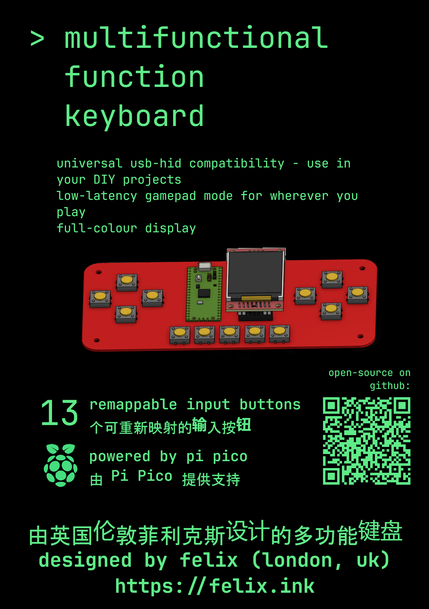
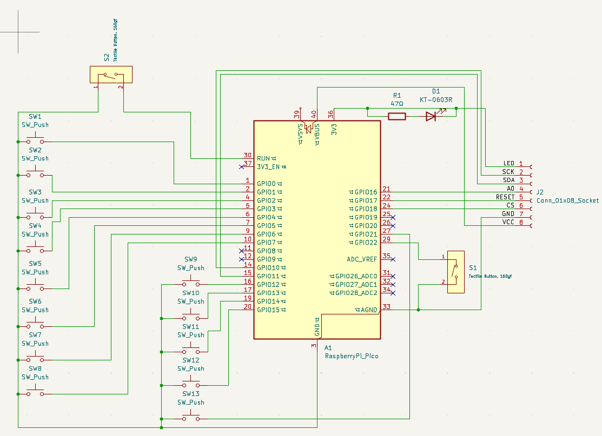

# multifunctional-fn-keyboard
A function keyboard that is also a game controller. Switch modes, display button mappings or (soon) cool graphics on the colour display, and connect to any USB device.

# Parts
- Display: [ST7735 LCD display from Temu](https://www.temu.com/uk/d--1-8-inch-st7735-spi-tft-lcd-display-module-with-a-resolution-of-128160-compatible-with-51-avr--arm-8---g-601101340072644.html)
- Microcontroller: Pi Pico 2 (definitely compatible with 2W, probably also with original series Picos)
- all other parts listed with LCSC part numbers in design/bom.csv
- 3D printed back case (base.stl)
- 4xM3 12mm (pan-head) screws with hex nuts
- Total part cost: £10.90 (excluding PCB production and case 3D printing)

# Renders

For demonstration only - colour and look will vary based on PCB manufacturing and colour used.

# Software
- Runs on MicroPython
- Uses basic USB keyboard inputs (currently - additional feature implementation in progress) so universally compatible with devices supporting USB HID
- Designed in KiCad (PCB) and OnShape (case), use these programs to open or edit.

# Usage
- (optional) Set up a custom .kb mappings file using the setup.py tool, ensure it is named mappings.kb or gamepad_mappings.kb for its use.
- Install main.py along with required micropython libraries (from external libraries section of readme), and .kb files, to the Pico.
- Connect to the device via USB. Press one button along with the HELP button to see what a button is mapped to. Hold down the 1,2,3,4&5 buttons simultaneously to switch from gamepad to keyboard mode (this leads to changed latencies for the specific use).

# References
- https://www.youtube.com/watch?v=KaGHxvVnKQ4 (1:24 for display pinout explanation)
- https://github.com/alastairhm/micropython-st7735 for MicroPython display driver - this library needs to be installed on the Pi Pico
- https://github.com/micropython/micropython-lib/tree/master/micropython/usb -  MicroPython HID implementation

# External libraries
- https://github.com/alastairhm/micropython-st7735/tree/main - SPI TFT with ST7735 Driver library for Raspberry Pi Pico Micropython

