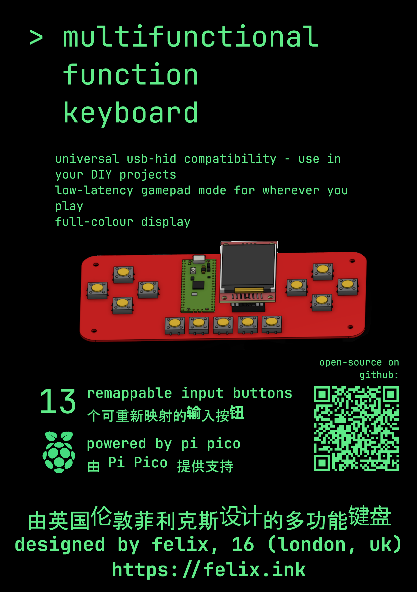
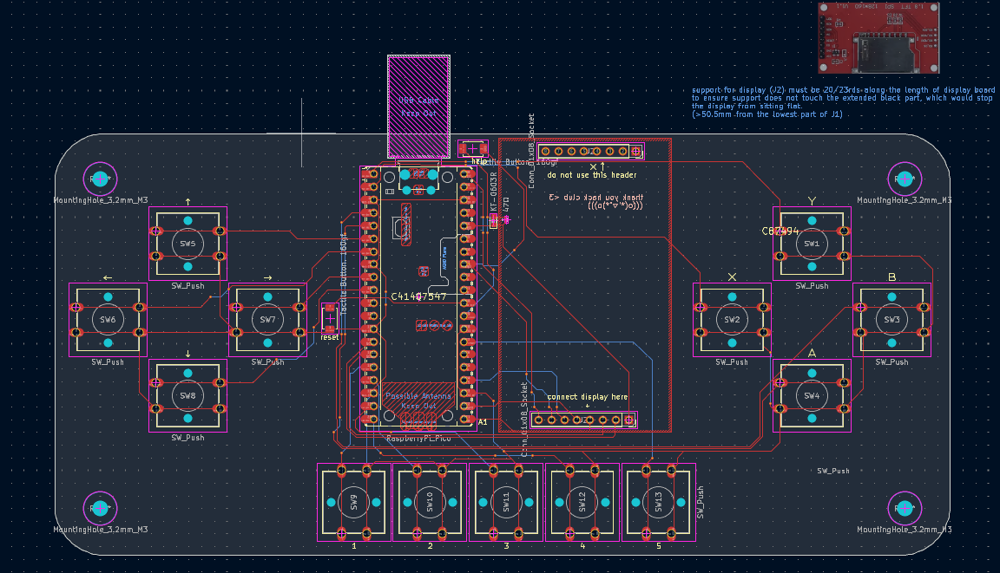
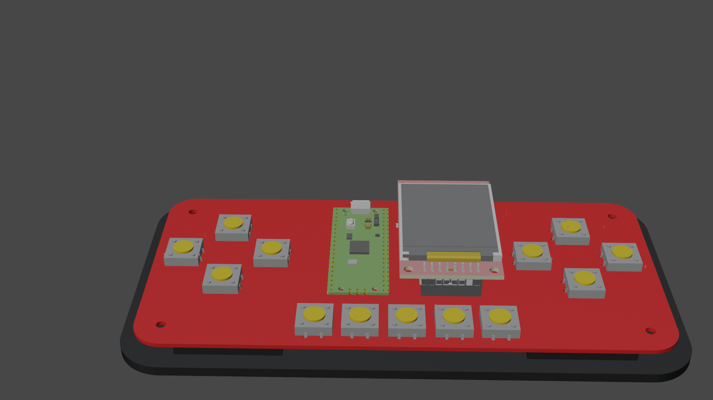
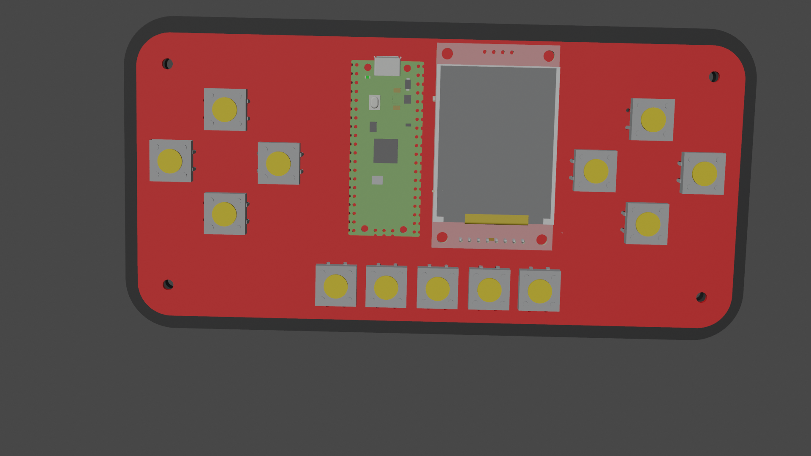

# multifunctional-fn-keyboard
A function keyboard that is also a game controller. Switch modes, display button mappings or (soon) cool graphics on the colour display, and connect to any USB device.

Schematic diagram showing the wiring of pins on the Pi Pico.

## Inspiration
I've always thought a little remappable keyboard would be super useful for input in DIY projects, to easily test USB input, and I love the GameCube controller's middle screen and wanted to design games around it, so I decided to build this project to combine those 2 goals. Once I build the physical model, I will test out multi-key input for deeper shortcuts within apps, to make it also work as a function keyboard. This seemed like an attainable project goal when I started, but it's also a fun product I will enjoy using.

# Parts
- Display: [ST7735 LCD display from Temu](https://www.temu.com/uk/d--1-8-inch-st7735-spi-tft-lcd-display-module-with-a-resolution-of-128160-compatible-with-51-avr--arm-8---g-601101340072644.html)
- Microcontroller: Pi Pico 2 (definitely compatible with 2W, probably also with original series Picos)
- Refer to (ibom.html)[design/bom/ibom.html] for interactive bill of materials
- all other parts listed with LCSC part numbers in design/production/bom.csv
- 3D printed back case (base.stl)
- 4xM3 12mm (pan-head) screws with hex nuts (to attach case)
- Total part cost: £10.90 (excluding PCB production and case 3D printing)

# Renders

For demonstration only - colour and look will vary based on PCB manufacturing and colour used.

# Details
- Runs on MicroPython - you need to [install this on the Pi Pico](https://www.raspberrypi.com/documentation/microcontrollers/micropython.html) before installing main.py, mappings.kb and gamepad_mappings.kb (the content of the mappings files can be the same, but you need one mappings.kb and one gamepad_mappings.kb for the firmware to run)  
- Uses basic USB keyboard inputs (currently - additional feature implementation in progress) so universally compatible with devices supporting USB HID
- Designed in KiCad (PCB) and [OnShape (case) - click to open source files](https://cad.onshape.com/documents/51850c34b98423dfb69681d3/w/19fcd9cddc7b2960ac2d3a69/e/14cd91361d094cded8dbd10b?renderMode=0&uiState=69dd64714df5b6410170c326), use these programs to open or edit.

# Setup guide
- Get together all of the parts listed in the parts list (the 3D-printed shell is optional but strongly recommended for safety and comfort).
- To get all of the parts I will manufacture the PCB using a service like JLCPCB using the Gerber source file (design/gerber.zip), purchase parts using the bom.csv file which can be uploaded directly to LCSC for convenience. It could be more cost-effective to buy a Pi Pico 2 from a local source than LCSC. I would recommend you do something similar.
- Solder on all parts as shown in diagrams, including the Pi Pico (2) which should be soldered onto the PCB. The soldering should be moderate/medium difficulty, but I have not assembled it yet myself. Alternatively, use a PCB-assembly service like JLCPCB (notes in PCB assembly section).
- (optional) design/ManufacturedPart.stl is the 3D printing file for the case. 3D print the case and use M3 12mm screws and hex nuts to attach it to the PCB.
- (optional) Set up a custom .kb mappings file using the setup.py tool, ensure it is named mappings.kb or gamepad_mappings.kb for its use.
- Install main.py along with required micropython libraries (from external libraries section of readme), and .kb files, to the Pico.
- Connect to the device via USB. Press one button along with the HELP button to see what a button is mapped to. Hold down the 1,2,3,4&5 buttons simultaneously to switch from gamepad to keyboard mode (this leads to changed latencies for the specific use).

# PCB assembly
- If you would prefer not to assemble the PCB by hand, I would recommend using a PCB assembly service, especially for the small parts that can be placed cheaply by this service.
- I made an effort to minimise the number of parts used that are outside the JLCPCB basic library, so that the model can be assembled affordably using the JLCPCB PCBA service, which charges a US$3 fee per JLCPCB 'extended' part used.
- Some parts like the Pi Pico itself are irreplaceable so I would recommend soldering them yourself, but you can pay a series of $3 fees to have it fully assembled if that suits you better.
- Please let me know if there are any JLCPCB basic parts that could be used as substitutes so I can integrate them into the design, but I have looked quite deeply into this so I doubt there are any.
- I have chosen the B3F-4000 switches because of their much larger number of cycles (3 million vs 100 thousand) which is important for a keyboard that would be used regularly. Feel free to substitute this to suit your usecase.

# References
- https://www.youtube.com/watch?v=KaGHxvVnKQ4 (1:24 for display pinout explanation)
- https://github.com/alastairhm/micropython-st7735 for MicroPython display driver - this library needs to be installed on the Pi Pico
- https://github.com/micropython/micropython-lib/tree/master/micropython/usb -  MicroPython HID implementation
- https://cad.onshape.com/documents/51850c34b98423dfb69681d3/w/19fcd9cddc7b2960ac2d3a69/e/14cd91361d094cded8dbd10b?renderMode=0&uiState=69dd64714df5b6410170c326 OnShape source files

# External libraries
- https://github.com/alastairhm/micropython-st7735/tree/main - SPI TFT with ST7735 Driver library for Raspberry Pi Pico Micropython

